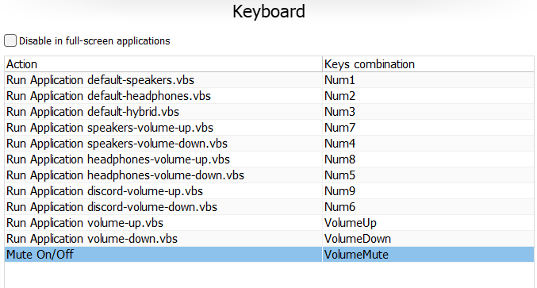

# Volume Steps Control

Simple python scripts that allow you to change default sound devices and the volume increment/decrement. All of it is done by using the wonderful [Sound Volume Command Line](https://www.nirsoft.net/utils/sound_volume_command_line.html) and [Sound Volume View](https://www.nirsoft.net/utils/sound_volume_view.html) tools. The pyton scripts are simply acting as a wrapper that executes the tools with your predefined settings.

## Scripts

In all my scripts you will have to modify the path to the svcl executable:
`exePath="%userprofile%\\svcl-x64\\svcl.exe"`

### change-volume-steps.py

Since Windows allows you to change volume only by 1 or 2 increment/decrement points then this script come to the rescue. I've decided to not follow the +X/-X logic and instead allow to specify the volume steps as a list and then switch volume to the closest step. For example:

`volumeSteps=[0,5,10,15,20,25,30,35,40,45,50,55,60,65,70,75,80,85,90,95,100]`

I have defined all of the steps above. It can be freely modified. By default the steps are incremented by +/-5%. So for example if your volume level for some reason is 53 then increasing will change it to 55 and decreasing to 50. This is to avoid situations where you might modify volume by using different sources or even using the volume slider in windows and to be sure the increments always work the same.

Example usage:
`python "%userprofile%\_GIT\volume-steps-control\change-volume-steps.py" "Arctis Nova 7" up`
`python "%userprofile%\_GIT\volume-steps-control\change-volume-steps.py" "discord.exe" down`

The names of the devices were found using [Sound Volume View](https://www.nirsoft.net/utils/sound_volume_view.html) tool. App names are same as their executable name.

### switch-default-devices.py

The idea behind this is that I usually have 3 scenarios:

1. I want to listen to music and everything on my speakers
2. I want to listen to music and everything on my headphones (other people in the room/don't disturb mode)
3. I want to play music on the speakers but at same time play games on my headphones etc.

This script allows to switch between those 3 scenarios. For example:

`python "%userprofile%\_GIT\volume-steps-control\switch-default-devices.py" speakers`
`python "%userprofile%\_GIT\volume-steps-control\switch-default-devices.py" headphones`
`python "%userprofile%\_GIT\volume-steps-control\switch-default-devices.py" hybrid`

There are 2 properties that have to be modified inside the script:

`headphonesName='Arctis Nova 7'`
`speakersName='Realtek(R) Audio'`

The names of those devices were found using [Sound Volume View](https://www.nirsoft.net/utils/sound_volume_view.html) tool.

Please note that since I listen to music mainly from web browsers then I am only modifying the `firefox.exe` and `chrome.exe` default sound devices. If you use spotify, winamp or anythng else then you will have to make small modifications to the script and add extra lines for your apps.

## Shortcuts

The [shortcuts](shortcuts) directory contains various Visual Basic Script files that can be used in [Volume2](https://github.com/irzyxa/Volume2), Keyboard mapping or macro tools etc. The reason why python scritps are wrapped in .vbs files is that this way they can be executed completely in the background (no popup windows, no terminal) and they also work in many more applications that allow only to execute a single file directly and have no option to run python scripts with arguments (like [Volume2](https://github.com/irzyxa/Volume2)).

Feel free to modify them according to your needs.

**Example:**

Above you can see my Volume2 setup. I have mapped my NumPad into various volume related shortcuts. Please note that you need an application that overrides those buttons on low level mode.

- Num 1-3 allow me to switch the volume modes
- Num 4 and 7 change volume of Speakers
- Num 5 and 8 change volume of Headphones
- Num 6 and 9 change volume of Discord (when I can't hear my friend in a game :-P)
- Volume Up and Volume Down buttons are overriden with my script so that pressing those buttons increments/decrements volume by 5.
- Mute button was not changed as default behaviour works well.
